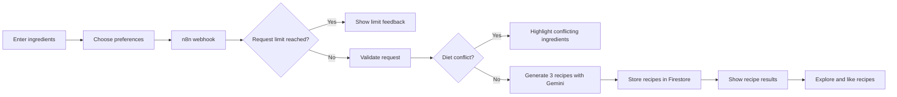

<div align="center">

# Code à Cuisine

### Turn what is already in your kitchen into something delicious.

An intelligent recipe generator that combines personal ingredients, dietary preferences, cooking time, and teamwork to create three tailored recipes with AI.


</div>

---

## About the project

Code à Cuisine helps people cook creatively with ingredients they already have at home. Instead of searching through countless recipes, users enter their available ingredients and choose how they want to cook.

The application then generates **three distinct recipes** that match the selected cuisine, diet, number of portions, available cooking time, and number of cooks.

The project combines a responsive Angular frontend with an n8n automation workflow, Google Gemini, Firebase Authentication, and Cloud Firestore. Generated recipes can be explored in the cookbook, filtered by cuisine, and liked by users.

## Highlights

| Feature | Description |
| --- | --- |
| Smart ingredient input | Autocomplete, keyboard navigation, quantity selection, editing, and duplicate prevention |
| Personal preferences | Portions, cooking time, cuisine, diet, and up to three cooks |
| AI recipe generation | Three structured and genuinely different recipes per successful request |
| Realistic ingredient usage | Entered quantities are treated as available maximums; recipes only use what they need |
| Diet validation | Vegan and vegetarian conflicts are detected before recipes are generated |
| Clear user feedback | Conflicting ingredients appear in the error dialog and are highlighted in the ingredient list |
| Collaborative cooking | Directions are assigned to cooks and parallel tasks are identified |
| Detailed recipes | Ingredients, extra ingredients, directions, nutrition, cooking time, and portions |
| Personal likes | Anonymous users can like and unlike each recipe once |
| Interactive cookbook | Most-liked recipes, cuisine categories, and paginated recipe lists |
| Protected AI usage | Daily limits per client and across the complete application |
| Error monitoring | A separate n8n workflow sends email notifications when executions fail |

## How it works



## The user journey

1. Enter at least three available ingredients and their quantities.
2. Select the number of portions and cooks.
3. Choose a cooking-time category, cuisine, and dietary preference.
4. Wait while the animated loading screen accompanies the AI generation.
5. Compare three tailored recipe suggestions.
6. Open a recipe to view its ingredients, instructions, cook assignments, and nutrition.
7. Like recipes and discover more inspiration in the cookbook.

If an ingredient conflicts with the chosen diet, generation stops. The application explains the conflict, displays the affected ingredients, and highlights them when the user returns to the ingredient form.

## Tech stack

### Frontend

- **Angular** for the application architecture and routing
- **TypeScript** for typed application logic
- **SCSS** for the responsive custom design
- **RxJS** for coordinating API responses and the minimum loading-animation duration

### Automation and AI

- **n8n** for webhook handling, validation, limits, AI orchestration, and error notifications
- **Google Gemini** for structured recipe generation and semantic diet validation
- **Structured Output Parser** for predictable recipe responses

### Backend services

- **Firebase Anonymous Authentication** for user-specific likes without registration
- **Cloud Firestore** for recipes, like data, timestamps, and cookbook queries
- **Firestore transactions** for consistent like and unlike operations
- **Firestore security rules** for controlled reads, writes, and like updates

## Request protection

The generation workflow protects the AI service with daily limits:

- Up to **3 generation requests per client identifier per day**
- Up to **12 generation requests across the application per day**
- Exactly **3 recipes per successful generation request**

n8n evaluates usage by the current date and returns an HTTP `429` response when a limit is reached. The Angular application translates this into a clear user-facing message.

## Error handling

The application distinguishes between several failure states:

- Missing or invalid form input
- Diet conflicts (`422`)
- Per-client or global daily limits (`429`)
- Invalid or incomplete AI responses
- Firebase storage failures
- General workflow or connection errors

A separate published n8n error workflow sends execution details by email when an automation fails.

## Getting started

### Prerequisites

Make sure the following tools and services are available:

- Node.js and npm
- Angular CLI
- A running n8n instance
- A Firebase project
- A Google Gemini credential in n8n
- A Gmail OAuth credential in n8n for optional error notifications

### Installation

```bash
git clone `https://github.com/edda14/code-a-cuisine.git`
cd code-a-cuisine
npm install
ng serve --open
```

## n8n configuration

The exported workflow files are located in:

```text
n8n/workflows/
```

Import the workflows into n8n and configure the required credentials through the n8n credential manager.

The main workflow is responsible for:

1. Receiving Angular requests through the webhook
2. Checking the per-client daily limit
3. Checking the global daily limit
4. Validating the request data
5. Validating dietary compatibility
6. Generating structured recipes with Gemini
7. Returning recipes or a specific HTTP error response

The Angular application calls the published endpoint:

```text
/webhook/generate-recipes
```

During local development, the Angular proxy forwards this route to the local n8n instance. The workflow must be **published** when using the production webhook path.

## Firebase configuration

1. Create or select a Firebase project.
2. Register a Firebase web application.
3. Enable **Anonymous Authentication**.
4. Create a **Cloud Firestore** database.
5. Add the Firebase web configuration to the Angular configuration file.
6. Publish the Firestore security rules included with the project.

Generated recipes are stored in the `recipes` collection. Likes are stored in a `likes` subcollection and connected to the anonymous user's ID.

## Security

- Gemini and Gmail credentials belong exclusively in the n8n credential manager.
- Never commit API secrets, OAuth client secrets, access tokens, or refresh tokens.
- Firebase web configuration is visible in frontend applications by design; security is enforced through Authentication, authorized domains, and Firestore rules.
- Inspect exported workflows before committing them.

Example workflow secret check:

```bash
grep -RniE 'AIza|client.?secret|access.?token|refresh.?token|api.?key' n8n/workflows
```

## Production build

```bash
ng build
```

The generated files are written to:

```text
dist/code-a-cuisine/
```

## Project structure

```text
code-a-cuisine/
├── n8n/
│   └── workflows/
├── public/
│   └── assets/
└── src/
    └── app/
        ├── pages/
        │   ├── home/
        │   ├── generate-recipe/
        │   ├── preferences/
        │   ├── loading/
        │   ├── results/
        │   ├── recipe/
        │   ├── cookbook/
        │   ├── categorie/
        │   └── impressum/
        ├── shared/
        │   ├── directives/
        │   ├── interfaces/
        │   └── services/
        └── firebase-config.ts
```

## Responsible use

AI-generated recipes and nutrition values are estimates. Users should always verify:

- Allergies and intolerances
- Dietary requirements
- Ingredient condition and food safety
- Appropriate cooking temperatures
- Whether generated instructions are suitable for their situation

Code à Cuisine does not replace professional medical or nutritional advice.

---

<div align="center">

### Designed and developed by Julia Schäffer

Built as an educational portfolio project with a focus on frontend development, workflow automation, AI integration, data persistence, security, and user experience.

</div>
